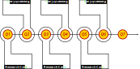

---
title: A proposal for scholarlycommons.org
created_at: 2017-02-04
updated_at: 2017-02-13
amount_usd: TBD
...

# What is needed for a scholarly commons?

Decision trees are a good start, but they are not enough on their own to create
a viable alternative to the current system. According to Diffusion of
Innovations we need a viable alternative that can be trialed, and I'm not
convinced that we have an existing viable alternative, hypothetical or
otherwise. We need a viable alternative, distinct and comprehensive enough to
be considered an alternative system of scholarly communication. We also need
this alternative system to be better than anything currently available, so that
there is real motivation to leave behind old practices and adopt new.

The Scholarly Commons is a culture, but we're missing critical infrastructure
to tie everything together and allow the culture of the Scholarly Commons to
thrive. It is not enough for disciplines to 'spin up their own variety of
commoning' ([Bruce Caron]). In order to tie everything together and avoid
perpetuating cultural and disciplinary silos, we need 'technical duct tape'
(also Bruce) harnessing the power of the Web to provide the machine
interoperability needed to tie together disciplines, cultures, languages,
questions, answers, inputs, outputs, data, sources of data, evidences,
standards, principles, practices, tools, projects, organizations, funders,
individuals, interfaces, and expectations across the globe in a unified way.

The work is composed of three interrelated subprojects:

[Open-research curation system][]
: Question-driven approach that exposes and preserves the researcher's process

[Research guides][]
: Semi-automated decision trees that guide and assist research

[Branding and visualization][]
: An integrative approach to the design and functionality of scholarlycommons.org

Value: $125k ($100 per hour base rate × 50 hours per week × 22 weeks)

Cost: TBD (see [caveat])

# Open-research curation system

_See [Defining the Commons Platform][DtheCP] and [my 400 word
response][Continuing the conversations] for some background thoughts, though
this is still a moving target._

The most fundamental purpose of this subproject is to provide a place to
explore and eventually answer the question: _what is the Scholarly Commons?_ It
will build upon all the work that we have done in the past as a steering
committee and working group, as well as the outputs from the workshops in
Madrid, Portland, and San Diego. Going forward, it will provide an open and
even playing field for anyone to contribute to the definition of the Scholarly
Commons.

The output of this subproject will be a modern, reusable, archetypical research
system, aligned with the culture of the Scholarly Commons, that could be used
for accomplishing Concept II (focused on the research process) of [Doable
pathways to the Scholarly Commons][Pathways], discussed during the San Diego
workshop. The Scholarly Commons should be a jumping-off point to new ways of
working together, taking the best ideas of how to do scholarship in a modern
setting, setting aside as many of the undesirable social and cultural
limitations as possible.

One of my greatest takeaways from the main track of the San Diego workshop was
that because the research processes were made explicit and studied this way, it
allowed the workshop attendees to reason about, find patterns, and learn from
them. With this end in mind, a central feature of this system will be exposing
the researcher's path explicitly. From the researcher's perspective, the entire
research process could be viewed as a sequence of decisions. These decisions
and the process of how they came about should form the basis of research
publication and collaboration.

If we don't make that process explicit, how will we be able to share,
reproduce, or assess the differences? If we keep the process implicit, or even
leave it to post facto analysis to attempt to reveal it all alone, we are
missing the whole point, and we end up not very far from where we are now:
publishing _about_ the research, instead of publishing _research_, and our
ability to effectively common will be impeded. What is needed is an
infrastructure where, as Jeffrey Schnapp says in his presentation on [Knowledge
Design], the process _is_ the product. 

The general approach will build on the early work of on Issue-Based Information
Systems ([IBIS]), Knowledge Media Institute's [Scholonto] later ideas, other
thoughts from the brightest minds on the future of scholarly communication, and
our own research on how to fit this all together that we have conducted over
the past several years. It will implement the best thinking on evidence and
argumentation in a collaborative research context, bringing in bits of
knowledge from around the Web, including existing declarations (building on
WP1), and mapping that knowledge together (building on WP2), all within a
beautiful, simple, and intuitive experience.

Wherever possible, this system will integrate with and connect current tools,
standards, and implementations instead of replacing existing functionality.

## Tentative high-level components

* Persistent identifiers for:
    * Researchers and other individuals (authentication via [ORCiD] and
      [IndieAuth] (or another Web-centric equivalent))
    * Organizations and groups (via [Grid])
    * Concepts
    * Questions
    * Everything else uniquely identifiable :-)
* Design an ontology (tentatively called the Research Intent Ontology [rio])
  that describes the process of knowledge design in research. It will be based
  upon ideas from [DecisionML], [IBIS], and [Scholonto], and is related to the
  recent [Design Intent Ontology][dio]
* Develop a user experience around the flow of research on the Scholarly
  Commons, including questions, peer-to-peer interactions, and versioning, that
  will form the basis of discourse as well as inform the development of the
  above ontology
* Create integrations with common tools, starting with the tools that we used
  during the course of this program, such as Google Docs, hypothes.is, Slack,
  and Trello
* stuff would happen via Hydra
* Use A/B testing to compare processes, ideas, and user interactions to find
  what works best

## The fundamental building block of scholarly communication

The basic premise is that our current outputs, implementations, and approaches
to scholarly communications, such as papers and working groups, are inherently
closed, and not in harmony with the culture of the Scholarly Commons. Openness
is more than just licensing and filetype compatibility, or even open admission
to a knowledge club. We need a way to open the process so that people can get
involved and can collaborate without the barrier of time or place.

The question is the most fundamental building block of scholarly communication.
[All researchers question][Why is open]. Questions are the bedrock upon which
all answers are pursued. Discovery happens after finding the right question to
ask. Making public one's own questions exposes the mind of the researcher, and
is the mental and cultural equivalent of a teacher flipping a class. Questions
partition research into tractable units of work. Questions are the intellectual
undercurrent of the research process. Questions invite the culture of openness
that we are so desiring to cultivate. 

This is not just another application. It is not a Facebook for science. I think
this approach is vital to the integrity of the Scholarly Commons. We need to
expose research at the cellular level. We need to expose it at this level of
granularity so that other people can involve themselves freely in research.
Otherwise we're still just dealing with closed groups, artifacts, and
processes.

## An organizational microstructure for research

The [Research Object] approach is fine for publishing a structural depiction of
research data, but what we need is a conceptual understanding of what the
researcher is trying to accomplish.

# Research guides

_See [Infrastructure Map Proposal][IMP] for some background thoughts, though
those ideas have evolved into something much more simple and distributed,
thanks to the discussion on decision trees that came out of the San Diego
workshop._

* the process trees would be a scholarly output of their own (WP3)
* each workflow would be exposed as a community best practice for a specific situation
* and also as the actual 'what happened' for a researcher
* these two would form a processual backbone of the Scholarly Commons
* and would make research reproducible

We've started by selecting the entities of data and software tools, but
tracking decisions could be useful during other parts of the research process.

myExperiment and Taverna

Explicate the development of every type of research output

Research guides. At any point, you should be able to see what the plan was (or
that there was no plan), and how plan that differed from what actually happened.

Semi-automating

Reuseable workflows

As more decision trees are curated and research done, use machine learning to
find patterns of commoning and then generate decision trees based on these
patterns, with the goal of assisting future research or decision tree design

## Macro guides

## Micro guides

# Branding and visualization

_See [Branding the Scholarly Commons][BtheSC] for some background thoughts,
though those thoughts have evolved since then somewhat. This is the only part
of this proposal unique to scholarlycommons.org._

Logo

## Visualization

_See [Infrastructure Map Proposal][IMP] for some background thoughts on this,
as well as some [earlier emails]._

The visualization builds upon the data and understandings obtained from the
[open-research curation system] and the [research guides] to help people (and
machines) see how the commons works, or how the resources of the commons
interact. Though scholarly commoning will be happening across all disciplines,
in some form or another, scholarlycommons.org will be the place that we study
_how_ and _why_ this commoning process actually happens, across all domains.
Think of the people studying the scholarly commons as a _[collective]_.

The visualization is made of representations of the types of resources used in
scholarly commoning, both interactional and artifactual. These resources are
represented visually as smaller components of a greater whole. The components
are a visual typology that will aid in understanding not only the details of
the research process, but how the culture of the Scholarly Commons provides a
more fluent and integrative research experience. Pieces of the research process
only fit together in a certain sequence. This visual typology will depict and
reinforce the sequential nature of how research actually happens or could
potentially happen.

The overall visualization is dynamic, as new types of resources are discovered,
and is based on an underlying map of the resources accessible to machines. It
will connect things that have previously been unconnected. At any given point
in time the map gives a picture of what the commons is at that particular point
in time. It is not a top-down rendering of what we would like it to be, but a
versioned representation of the actual resources and potential interactions
between those resources. At first these resources will be more domain-agnostic,
but over time, more and more domain-specific resources will be represented.

# Other functionalities

* Web pages
* Blog

# Governance

(?) This project is governed in partnership with FORCE11 and Pentandra, rather than
a one-time outsourcing to a contractor or vendor.

Not advisory board, but invitations to collaborate directly.

I'm open to options here. 

# Maintenance

# Accessibility

# A tentative development schedule for scholarlycommons.org

The work will be organized into 11 two-week sprints. All three subprojects will
be developed incrementally and simultaneously, as they will inform each other
during the development process.

* Sprint 1: Feb 13–24
* Sprint 2: Feb 27–Mar 10
* Sprint 3: Mar 6–Mar 17
* Sprint 4: Mar 20–Mar 31

(Spring Break: Apr 3–Apr 7)

* Sprint 5: Apr 10–Apr 21 (Everything desired for the CC Summit must be
  completed by the end of this sprint)
* Sprint 6: Apr 24–May 5
* Sprint 7: May 8–May 19
* Sprint 8: May 22–Jun 2
* Sprint 9: Jun 5–Jun 16

(Summer Vacation at Yellowstone: Jul 3–Jul 7)

* Sprint 10: Jun 19–Jun 30
* Sprint 11: Jul 10–Jul 21

[dio]: <https://w3id.org/dio>
[IBIS]: <https://en.wikipedia.org/wiki/Issue-Based_Information_System> "Issue-based Information Systems on Wikipedia"
[DecisionML]: <https://www.w3.org/2005/Incubator/decision/wiki/Draft_Final_Report>
[Scholonto]: <http://projects.kmi.open.ac.uk/scholonto/>
[Hydra]: <https://hydra-cg.com>
[Knowledge Design]: <http://jeffreyschnapp.com/wp-content/uploads/2011/06/HH_lectures_Schnapp_01.pdf>
[Verborgh]: <https://ruben.verborgh.org/phd/>
[DtheCP]: <https://docs.google.com/document/d/1iZplXo3meTR5164fbkk40-CrauZk89PgxvsZ_jDPTCQ/edit> "Defining the Commons Platform Proposal"
[IMP]: <https://docs.google.com/document/d/1ciLAzl65ppmJ_GOPrpkA-s8XXLBmqocME1KkQ5adgUc/edit> "Infrastructure Map Proposal"
[BtheSC]: <https://docs.google.com/document/d/1YIxxMpcOni7alThkdVvvrnc_edKay2Ow4kiRwBDTQrs/edit> "Branding the Scholarly Commons"
[Bruce Caron]: <https://cybersocialstructure.org/2016/10/18/think-of-science-like-an-incurable-intellectual-disease-part-3/>
[collective]: <https://cybersocialstructure.org/2016/10/03/think-of-science-like-an-incurable-intellectual-disease/>
[caveat]: <https://groups.google.com/a/force11.org/d/msg/steering-scwg/tE8yA-zEGrU/F2yMIEuFCAAJ>
[Pathways]: <https://docs.google.com/document/d/1iGiLTimTeue-Gumk0BZZfzOeDHNJI8jvRRYY84ZHVcc/edit?usp=sharing> "Doable pathways to the Scholarly Commons"
[Why is open]: <http://cameronneylon.net/blog/not-what-not-who-or-how-but-why-is-open/> "Not what, not who, or how, but Why is Open? by Cameron Neylon"
[Research Object]: <http://researchobject.org>
[earlier emails]: <https://docs.google.com/document/d/1y8AZWIJN5mJ3xloxXblsSENmvl4meBn0H2rxUG8HIec/edit?usp=sharing> 
[ORCiD]: <https://orcid.org/>
[IndieAuth]: <https://indieweb.org/IndieAuth>
[Continuing the conversations]: <https://docs.google.com/document/d/1eF30cXlPhKHW9brLonb2UJkM4Gk5vcpbegS3D-3tOnA/edit?usp=sharing>
